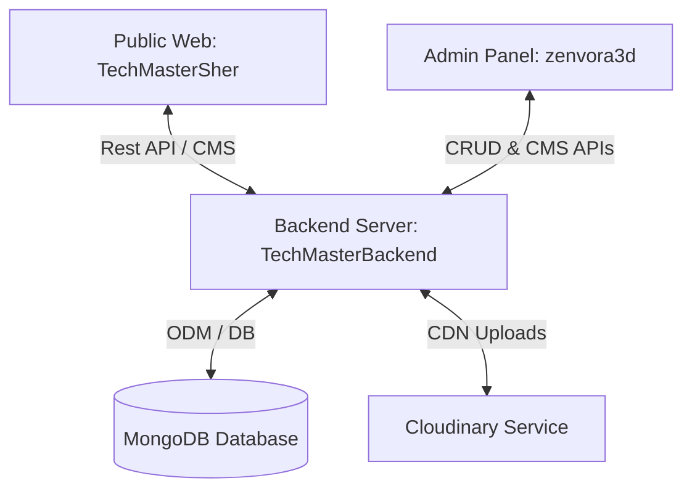

# Zenvora Tech-Master CMS Suite

A high-performance, premium web platform consisting of a dynamic 3D web experience, a robust administrative panel, and a scalable content management backend API.

---

## 📂 Project Architecture

The workspace is organized as a monorepo containing three core components:



### 1. 🌐 Public Frontend (`TechMasterSher`)
The main viewer-facing landing hub. Designed with premium luxury dark aesthetics, dynamic animations, and interactive elements.
- **Framework:** React + TypeScript (Vite)
- **Styling:** Tailwind CSS + custom glassmorphic overlays
- **Cinematic Visuals:** Three.js / React Three Fiber (R3F) for interactive 3D shader particles and models, GSAP (GreenSock) for scroll parallax, and Framer Motion for UI states.
- **Dynamic Content:** Integrated with the backend API to render blogs, events, portfolios, services, policies, and navigation controls dynamically.

### 2. 🛡️ Administrative Dashboard (`zenvora3d`)
A secure, custom administrative portal to manage all copy, navigation, structure, policies, and files displayed on the main website.
- **Framework:** React + JavaScript / TypeScript (Vite)
- **CMS Modules:**
  - **Homepage & Hero CMS:** Section controls, visibility toggles, and metadata settings.
  - **Founder Journey & Timeline:** Milestone blocks, growth roadmaps, and badge configurations.
  - **Mission & Vision:** Fundamental principles, brand pillars, and strategical milestones.
  - **Contact & Inbox Manager:** Live enquiries database viewer with filter logic and resume attachment downloads.
  - **SEO & Navigation Controls:** Core site meta settings and customizable header/footer links.
- **Design Tokens:** High-end premium dark themes with customized gold accents.

### 3. ⚙️ Content Management API Server (`TechMasterBackend`)
A robust RESTful API backend handling business logic, database persistence, media processing, and validation pipelines.
- **Runtime:** Node.js + Express (TypeScript compiled to ES modules)
- **Database:** MongoDB via Mongoose ODM schemas
- **Integrations:**
  - **Cloudinary:** Dynamic storage and secure URL generation for image and video uploads.
  - **Instaloader / Scraper Logic:** Dynamic metadata extractor for Instagram Reels and YouTube Shorts URLs.
  - **Express Router:** Modular controller pipelines for campaigns, blogs, media, users, contact forms, and aggregated CMS requests.

---

## ✨ Features & Technical Implementation

### 🌀 3D Interactive Canvas
A Three.js viewport (`SceneContainer.tsx` + `GlassSphere.tsx`) overlays a dynamic 3D lion head (Sher) model mapped with custom GLSL shaders.
- Centered on mobile devices to prevent layout breaking, with standard scale scaling to ensure it fits mobile viewports.
- Responsive hover tracking reacts to desktop mouse movements and scroll coordinates.

### 📼 Instagram Reels & Shorts Dynamic Metadata Scraper
Automated real-time background parsing of Reels and YouTube Shorts URLs.
- Fetches active view counts, channel headers, and author handles.
- Bypasses static image/video placeholder blocks for reels, supporting fallback embedding logic.

### 📬 Live Inbox Manager
Dynamic contact form submissions pipeline with:
- Categories selector filtering (Admissions, Collaborations, Careers, Campaigns).
- Null-safe query fields search across entries.
- Direct resume attachment downloads powered by CDN uploads.

---

## 🚀 Get Started

### Prerequisites
- [Node.js](https://nodejs.org/) (v18 or higher recommended)
- [MongoDB Connection URI](https://www.mongodb.com/cloud/atlas)
- [Cloudinary Credentials](https://cloudinary.com/) (Cloud Name, API Key, API Secret)

---

### Setup Instructions

#### 1. Setup Backend (`TechMasterBackend`)
1. Navigate to the backend directory:
   ```bash
   cd TechMasterBackend
   ```
2. Install dependencies:
   ```bash
   npm install
   ```
3. Configure your Environment Variables by creating a `.env` file:
   ```env
   PORT=5000
   MONGODB_URI=mongodb+srv://...
   CLOUDINARY_CLOUD_NAME=your-cloud-name
   CLOUDINARY_API_KEY=your-api-key
   CLOUDINARY_API_SECRET=your-api-secret
   JWT_SECRET=your-jwt-secret
   ```
4. Build and start the compiler:
   ```bash
   npm run build
   npm run dev
   ```

#### 2. Setup Admin Dashboard (`zenvora3d`)
1. Navigate to the dashboard directory:
   ```bash
   cd zenvora3d
   ```
2. Install dependencies:
   ```bash
   npm install
   ```
3. Configure the Environment API URL inside `.env` or development configs:
   ```env
   VITE_API_URL=http://localhost:5000/api/v1
   ```
4. Launch the local development server:
   ```bash
   npm run dev
   ```

#### 3. Setup Frontend Website (`TechMasterSher`)
1. Navigate to the frontend directory:
   ```bash
   cd TechMasterSher
   ```
2. Install dependencies:
   ```bash
   npm install
   ```
3. Setup local configs:
   ```env
   VITE_API_URL=http://localhost:5000/api/v1
   ```
4. Start the application:
   ```bash
   npm run dev
   ```

---

## 🛠️ Build Commands

For production deployments, compile target bundles using:

| Module | Build Command | Output Folder |
| :--- | :--- | :--- |
| **Backend API** | `npm run build` | `dist/` |
| **Admin Panel** | `npm run build` | `dist/` |
| **Frontend Web** | `npm run build` | `dist/` |
